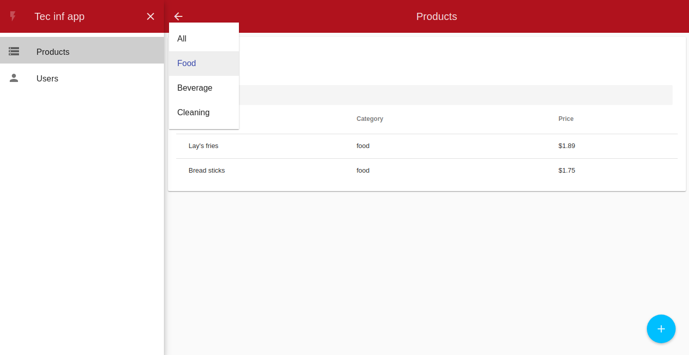
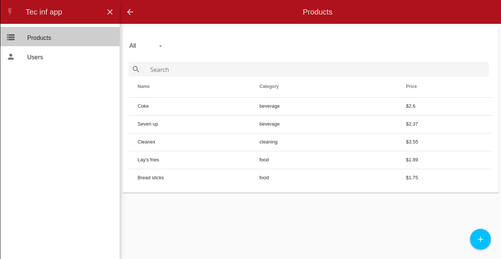
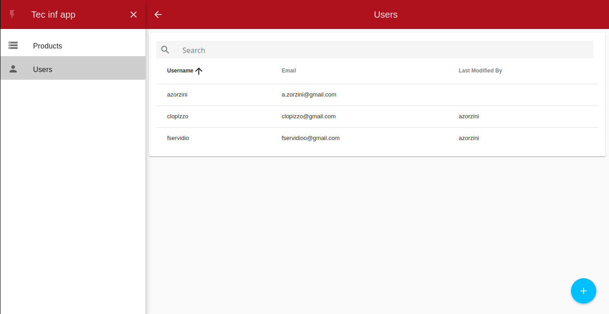

# Users and products
Small academic webapp to manage users and products





## Features
* CRUD of Users
* CRUD of product
* Filters

## Tools involved
* Angular 1.x
* Angular Material
* Yeoman generator
* Grunt

## Instructions to run
it is necessary to have the [backend app](https://github.com/azorzini/tp-tecnologias-informaticas) application running

```
npm install
cd src
bower install
cd ..
grunt serve
```